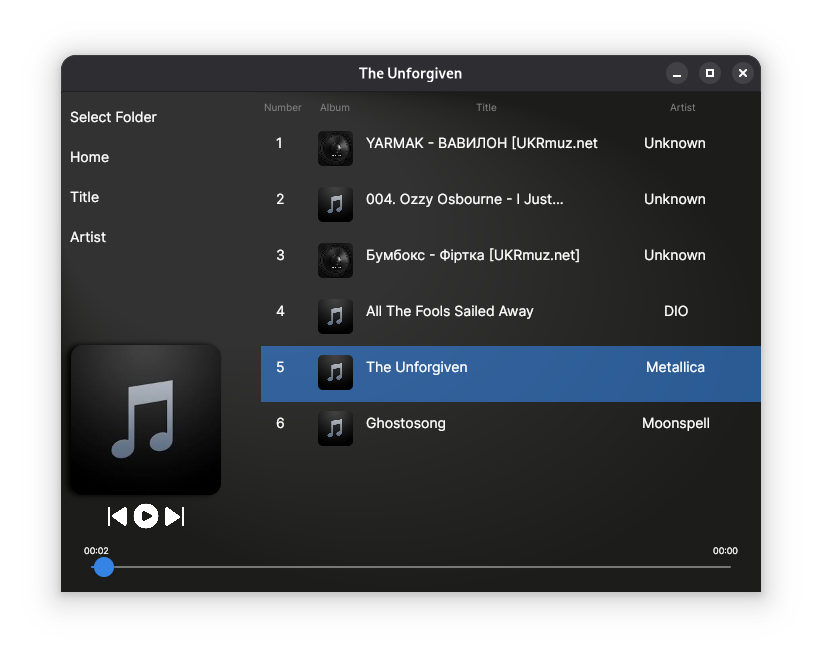

# PlayerAvalonia

**Simple cross-platform audio player built with .NET 9 and Avalonia UI 11.**
The app allows you yo play local music files organize them in a clean,modern interface.

## Features
- Select a folder with your music
- Playback support for popular formats (MP3, WAV, FLAC)
- Sort tracks by title or artist
- Dark modern UI desing

## Tech Stack
| Technology | Description | Link |
|------------|-------------|------|
| [.NET 9](https://github.com/dotnet/runtime) | Core runtime and framework | ⭐ |
| [Avalonia UI](https://github.com/AvaloniaUI/Avalonia) | Cross-platform UI framework | 🎨 |
| [ManagedBass](https://github.com/ManagedBass/ManagedBass) | Cross-platform audio library | 🎵 |
| [TagLib#](https://github.com/mono/taglib-sharp) | Metadata reader (title, artist, album art) | 🏷️ |
